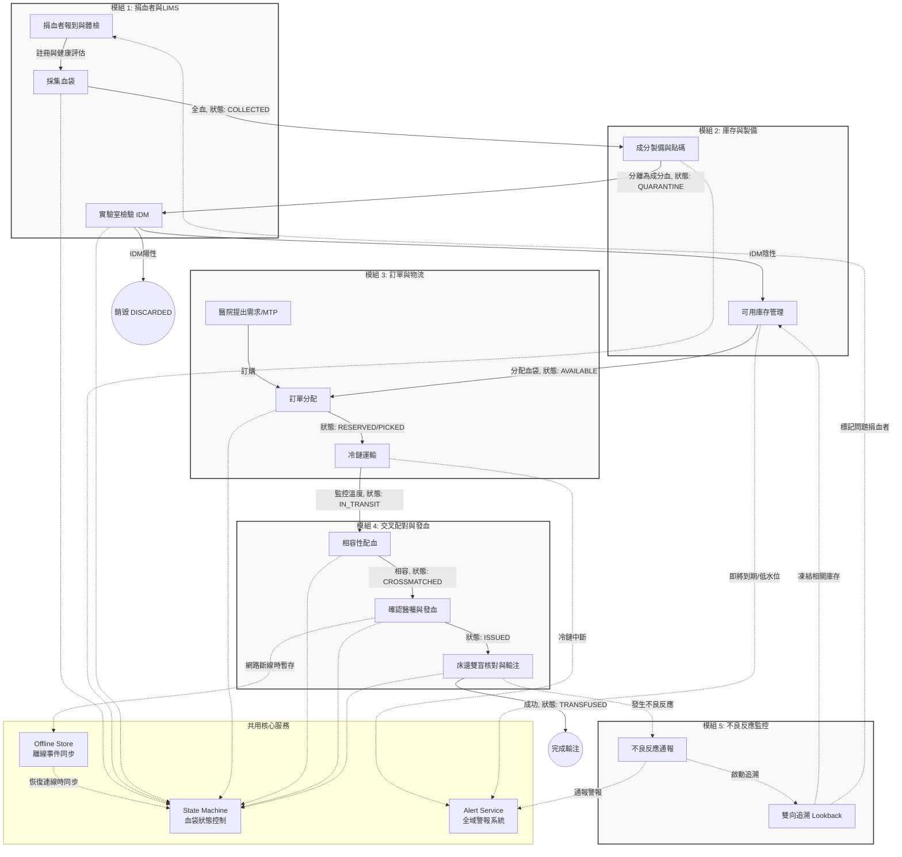

# 系統架構與作業流程總覽 (System Architecture and Workflow)

本文件概述越南血液管理系統（Vietnam Blood Management System）的核心模組、內部作業流程以及模組間的互動關聯。本系統透過嚴密的狀態機 (State Machine) 和檢核機制，確保血液自採集至輸注的每一個環節皆符合高度的安全標準。

## 一、 系統主要模組 (System Modules)

透過分析原始碼與系統設計，本專案主要劃分為五大子系統（模組），每個模組對應特定的業務職責與前端介面：

1. **捐血者管理與實驗室資訊管理 (Donor Management & LIMS)**
   - **核心職責**：捐血者報到、體檢篩檢、採血以及實驗室檢驗（血型與傳染病 IDM 檢驗）。也包含罕見血型捐血者的管理。
   - **對應程式碼/介面**：`DonorCenterSimulatorView`, `RareDonorView`。

2. **血液製備與庫存管理 (Blood Components & Inventory Management)**
   - **核心職責**：將全血分離為各類成分血（如 PRBC, FFP, PLT），列印 ISBT 128 條碼，並進行溫控與效期監控的庫存管理。
   - **對應程式碼/介面**：`WarehouseView`, `ResourceManagementView`, `validators.ts`。

3. **醫院需求與訂單管理 (Hospital Request & Order Management)**
   - **核心職責**：處理醫院的常規與緊急訂單，包含大量輸血協定 (MTP) 的啟動。訂單出庫後的物流與冷鏈運輸追蹤（物聯網整合）。
   - **對應程式碼/介面**：`HospitalOperatorView`, `DispatcherView`, `CourierView`, `MtpEmergencyView`。

4. **受血者交叉配對與發血 (Recipient Cross-Matching & Issuance)**
   - **核心職責**：為病患檢體與庫存血袋進行相容性交叉配對。確保符合 ABO/Rh 相容性矩陣，執行雙盲驗證後發血。
   - **對應程式碼/介面**：`CrossmatchView`, `BedsideVerificationView`, `bloodSafety.ts`。

5. **輸血安全監控與不良反應 (Hemovigilance & Transfusion Reaction)**
   - **核心職責**：追蹤血液輸注後的病患反應。發生不良反應時，啟動雙向追溯機制（Forward/Backward Lookback）並通報相關人員。
   - **對應程式碼/介面**：`HemovigilanceView`, `alertService.ts`。

## 二、 內部主要作業流程 (Internal Workflows)

系統的核心作業流程由 `src/lib/stateMachine.ts` 中的血袋狀態機 (Blood Unit State Machine) 嚴格控制，血袋必須依序通過以下生命週期，且任何違反規則的轉移都會被阻擋。

1. **採集與隔離 (COLLECTED → QUARANTINE)**
   - **流程**：捐血完成後，血袋狀態設為 `COLLECTED`，進入處理與製備後轉為 `QUARANTINE`（隔離）。
   - **限制**：處於隔離狀態的血袋絕對無法被訂購或發放。

2. **檢驗與放行 (QUARANTINE → AVAILABLE / DISCARDED)**
   - **流程**：等待 LIMS 回傳傳染病 (IDM) 篩檢結果。
   - **限制**：若結果為陰性 (`CLEARED`)，狀態轉為 `AVAILABLE`；若為陽性 (`REACTIVE`)，則直接轉為 `DISCARDED`。

3. **訂購與配血 (AVAILABLE → RESERVED → PICKED → IN_TRANSIT → RECEIVED)**
   - **流程**：醫院發出需求且訂單核准後，血袋被 `RESERVED`。物流人員掃描條碼取血 (`PICKED`) 並運送 (`IN_TRANSIT`)，過程中全程監控冷鏈。抵達醫院掃描後狀態轉為 `RECEIVED`。

4. **發血與輸注 (RECEIVED → CROSSMATCHED → ISSUED → TRANSFUSED)**
   - **流程**：醫院接收後進行交叉配對。配對相容 (`Compatible`) 後轉為 `CROSSMATCHED`。確認醫囑後發出 (`ISSUED`)。護理人員在床邊進行雙重核對，成功後轉為終端狀態 `TRANSFUSED`。
   - **限制**：若交叉配對結果不相容或血袋已過期，則無法進行後續作業。

5. **異常與退回 (ISSUED → RETURNED → WASTED / AVAILABLE)**
   - **流程**：若發出後未輸注，必須在 30 分鐘內退回。退回後若冷鏈與外觀檢查合格，可恢復為 `AVAILABLE`；否則轉為終端狀態 `WASTED`。

## 三、 模組互動關聯 (Module Interactions)

五大模組之間並非獨立運作，而是透過共用的資料庫、狀態機引擎以及警報服務 (`alertService.ts`) 進行緊密的互動。當特定事件發生時，系統會跨模組連動，確保資訊同步與輸血安全。同時，針對網路不穩定的環境，系統實作了離線事件處理 (`offlineStore.ts`)，以確保醫療服務不中斷。

### 互動關聯圖 (Mermaid Diagram)

### 關鍵機制說明
- **State Machine 守門員**：所有跨模組的血袋實體轉移，皆需透過 `BloodUnitStateMachine.transition()`，驗證前置條件與操作者權限。例如，未獲實驗室清空的血袋無法進入庫存；未通過配對的血袋無法發出。
- **Alert Service 警報連動**：當庫存水位過低、冷鏈中斷（模組 3）或發生不良反應（模組 5）時，會透過 `AlertService.create()` 廣播全域警報。
- **雙向追溯 (Lookback)**：模組 5 偵測到嚴重反應時，會直接連動模組 2 凍結同批次血品，並通知模組 1 標記捐血者。
- **離線容錯 (Offline Tolerance)**：緊急發血等操作（模組 4）若遇斷網，會將事件存入 `offlineStore.ts`，待網路恢復後再交由 State Machine 驗證與同步。