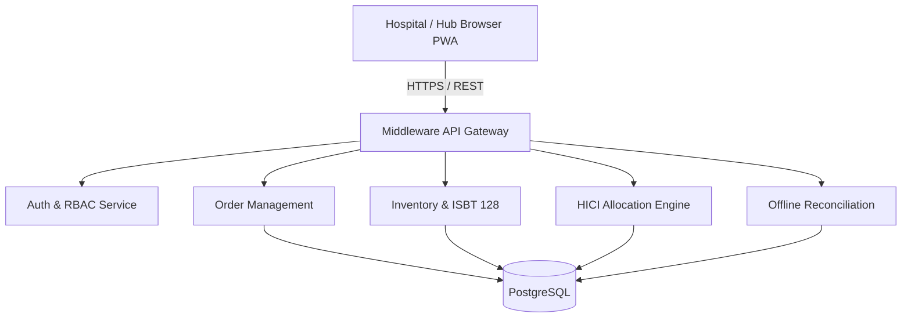
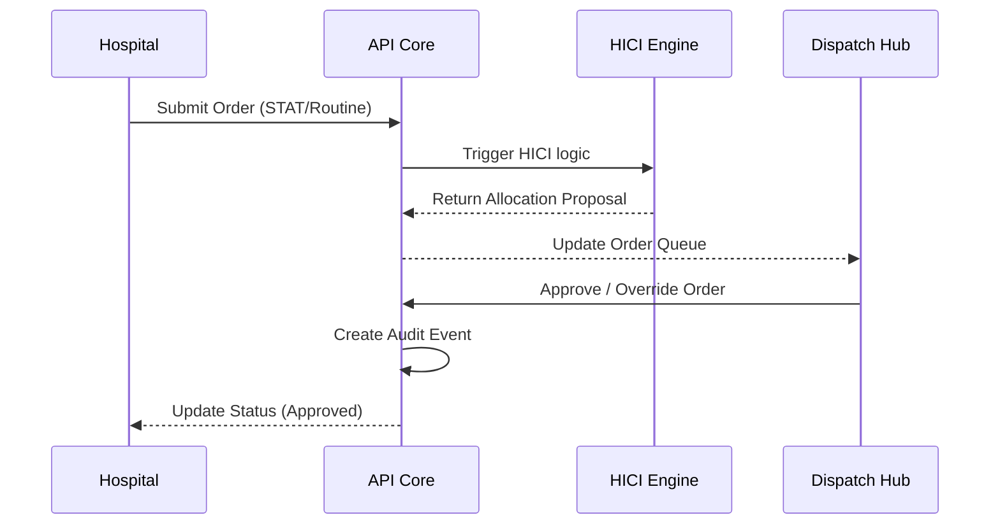

# 系統架構設計 (Prompt 1)

## Architecture Overview
採 B/S 架構之網頁應用。
- **Frontend:** React 19 + TypeScript + Vite + Tailwind CSS + shadcn/ui. (Support PWA for offline fallback).
- **Backend:** Node.js (Express), RESTful API (Ready for HL7 FHIR mapping layer).
- **Database:** PostgreSQL.
- **Infrastructure:** Cloud Run / Containerized setup, ensuring single port (3000) for platform accessibility.

## Component Diagram

## Data Flow Diagram

## Security Boundary & Offline Mode
- **Offline Mode:** Front-end PWA uses IndexedDB/LocalStorage (encrypted) to store `OfflineReleaseEvent` and Product Catalog subsets. `OfflineSync` API handles batch reconciliation with idempotency and hash verification.
- **Audit Trail:** Append-only access for `audit_events` in DB. No API available to DELETE records.
- **Barcode Validation:** Handled server-side when online, or via edge-logic locally when offline (for MTP/Emergency).

## Scope Split
- **MVP (Phase 1):** Auth, Hospital Panel (Orders), Dispatch Hub (Triage, HITL), Basic Barcode Validation, Audit Events.
- **Phase 2:** Complete MTP workflow, Offline Fallback & Sync, Full FHIR integration.

## Implementation Risks
- Offline conflict resolution mechanism (concurrency issues).
- Local fallback data limits and patient info security.
