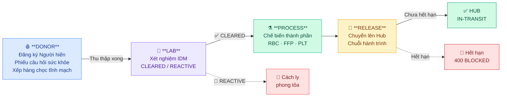
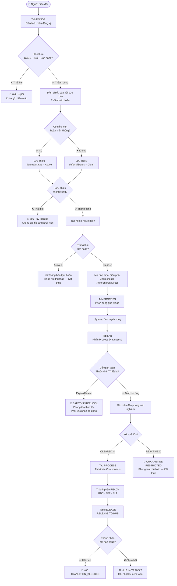
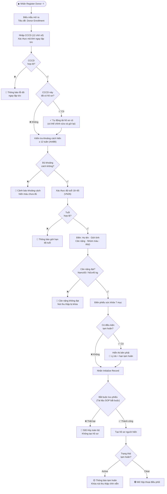
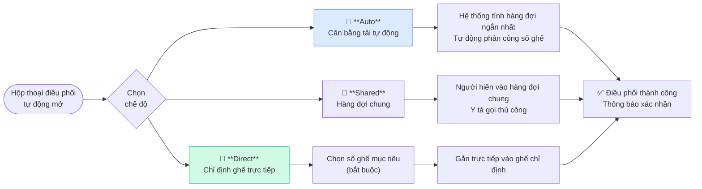
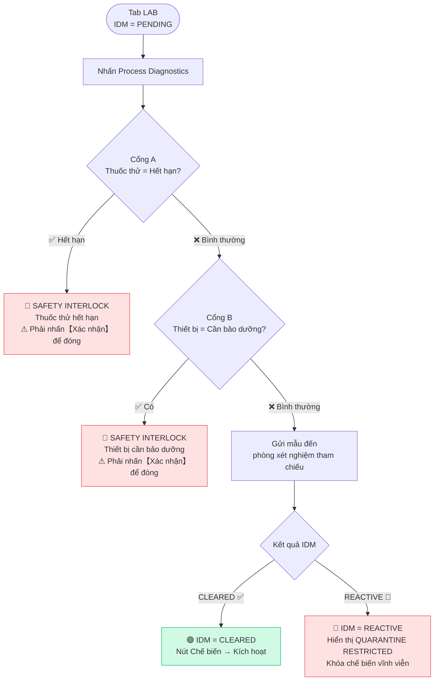
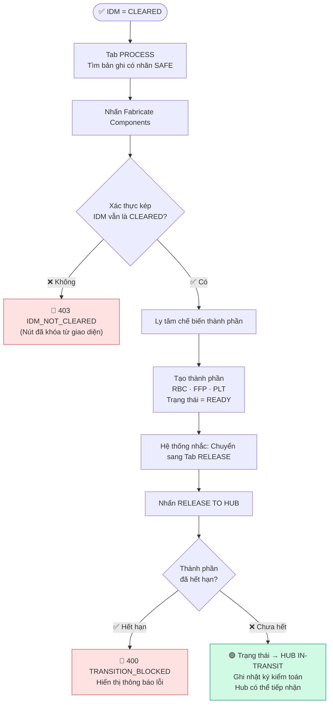
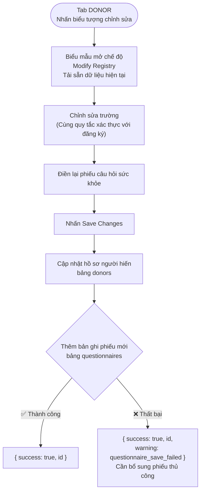

# Hướng dẫn Sử dụng LIMS Trung tâm Hiến máu

**Mã tài liệu:** UM-LIMS-01 &nbsp;|&nbsp; **Phiên bản:** 1.1 &nbsp;|&nbsp; **Cập nhật:** 2026-05-30 &nbsp;|&nbsp; **Phiên bản hệ thống:** VN-BECS V2

---

## 1. Tổng quan hệ thống con

LIMS Trung tâm Hiến máu (Laboratory Information Management System) mô phỏng nền tảng eProgesa, quản lý toàn bộ quy trình lâm sàng từ khi người hiến máu đến đăng ký cho đến khi thành phần máu được chuyển đến Hub.

Hệ thống tuân thủ **VN26** (Quy chuẩn an toàn máu Bộ Y tế Việt Nam) và **Sổ tay Kỹ thuật AABB** (khoảng cách hiến, thể tích thu thập).

### Quy trình bốn giai đoạn

| Giai đoạn | Tab | Chức năng chính |
|-----------|-----|----------------|
| **DONOR** | Quản lý đăng ký | Đăng ký người hiến, phiếu sức khỏe, điều phối ghế lấy máu |
| **LAB** | Chẩn đoán lâm sàng | Xét nghiệm huyết thanh IDM (CLEARED / REACTIVE / PENDING) |
| **PROCESS** | Chế biến thành phần | Ly tâm RBC / FFP / PLT, quản lý ghế triage |
| **RELEASE** | Chuỗi hành trình | Chuyển thành phần máu lên Hub, bàn giao lưu ký |

---

## 2. Danh sách chức năng

| Chức năng | Trạng thái | API |
|-----------|-----------|-----|
| Đăng ký người hiến (mới) | ✅ | POST `/api/v1/lims/donors` |
| Chỉnh sửa hồ sơ người hiến | ✅ | PUT `/api/v1/lims/donors/[id]` |
| Truy vấn danh sách người hiến | ✅ | GET `/api/v1/lims/donors` |
| Phiếu câu hỏi sức khỏe | ✅ | Gửi kèm biểu mẫu đăng ký |
| Điều phối ghế lấy máu | ✅ | Ba chế độ: Auto / Shared / Direct |
| Quản lý hàng đợi | ✅ | PUT/DELETE `/api/v1/lims/queues/[id]` |
| Gửi xét nghiệm IDM | ✅ | POST `/api/v1/lims/lab-tests/[id]/run` |
| Chế biến thành phần (ly tâm) | ✅ | POST `/api/v1/lims/process-component/[id]` |
| Phát máu lên Hub | ✅ | POST `/api/v1/lims/components/[id]/release` |
| Chỉ số sẵn sàng thông lượng | ✅ | KPI thời gian thực (góc trên phải) |

---

## 3. Quy trình vận hành

### 3.0 Tổng quan quy trình

---

### Quy trình 1: Đăng ký người hiến máu (Tab DONOR)

#### Các bước và xác thực

#### Tra cứu nhanh các trường

| Trường | Bắt buộc | Quy tắc xác thực |
|--------|---------|-----------------|
| CCCD (Căn cước công dân) | ✅ | 12 chữ số, mã tỉnh hợp lệ |
| Họ và tên | ✅ | Định dạng tên tiếng Việt, không có số hay ký tự đặc biệt |
| Ngày sinh | ✅ | YYYY/MM/DD, tuổi 18–65 |
| Giới tính | ✅ | Nam / Nữ (ảnh hưởng đến hiển thị câu hỏi thai sản) |
| Cân nặng (KG) | ✅ | Nam ≥ 50 / Nữ ≥ 45 kg |
| Nhóm máu / RhD | ✅ | Danh sách thả xuống |

---

### Quy trình 2: Điều phối ghế lấy máu

| Chế độ | Khi nào dùng | Hành vi hệ thống |
|--------|------------|-----------------|
| **Auto** | Giờ cao điểm, phân luồng đều | Tính độ dài hàng đợi tất cả ghế, chọn ngắn nhất |
| **Shared** | Ghế chưa xác định | Người hiến vào hàng đợi chung, y tá gọi |
| **Direct** | Nhu cầu đặc biệt (khuyết tật/VIP) | Gắn cứng vào ghế chỉ định |

---

### Quy trình 3: Xét nghiệm IDM (Tab LAB)

> **Cổng an toàn:** Khi kích hoạt, toàn bộ bảng thao tác bị khóa, hiển thị cảnh báo đỏ toàn màn hình. Nhân viên **bắt buộc** nhấn【Xác nhận】thủ công để đóng — hệ thống không tự giải phóng.

---

### Quy trình 4: Chế biến thành phần và phát máu lên Hub

#### Quy tắc chế biến thành phần

| Trạng thái IDM | Nhãn Tab PROCESS | Nút Chế biến |
|---------------|-----------------|-------------|
| CLEARED | 🟢 SAFE | ✅ Khả dụng |
| REACTIVE | 🔴 QUARANTINE RESTRICTED | 🚫 Khóa vĩnh viễn |
| PENDING | 🟡 BIO-RISK | 🚫 Khóa |

---

### Quy trình 5: Chỉnh sửa hồ sơ người hiến

> **Thiết kế kiểm toán:** Phiếu câu hỏi dùng chiến lược «thêm mới», mỗi lần chỉnh sửa tạo bản ghi mới, giữ nguyên lịch sử quyết định. Phù hợp với yêu cầu kiểm toán của AABB và VN26.

---

## 4. Đặc tả trường giao diện

### 4.1 Biểu mẫu đăng ký người hiến

| Trường | Loại | Bắt buộc | Quy tắc xác thực | Ghi chú |
|--------|------|---------|-----------------|---------|
| CCCD | Số (12 chữ số) | ✅ | Mã tỉnh hợp lệ | Quét thẻ chip hoặc nhập tay |
| Họ và tên | Văn bản | ✅ | Định dạng tên tiếng Việt | Tự động viết hoa |
| Ngày sinh | YYYY/MM/DD | ✅ | Tuổi 18–65 (VN26) | Tự động định dạng dấu phân cách |
| Giới tính | Danh sách | ✅ | Nam / Nữ | Ảnh hưởng câu hỏi thai sản |
| Cân nặng (KG) | Số | ✅ | Nam ≥ 50 / Nữ ≥ 45 kg | Ảnh hưởng giới hạn thể tích |
| Nhóm máu | Danh sách | ✅ | O / A / B / AB | — |
| RhD | Danh sách | ✅ | Dương / Âm | — |

### 4.2 Phiếu câu hỏi sức khỏe (7 điều kiện tạm hoãn)

| Câu hỏi | Thời gian tạm hoãn |
|---------|------------------|
| Xăm mình gần đây | 12 tuần |
| Đến vùng có sốt rét | 12 tuần |
| Cơ thể không khỏe | Tạm thời (hồi phục thì hủy) |
| Hành vi nguy cơ cao | Vĩnh viễn |
| Vắc-xin gần đây | 4 tuần |
| Phẫu thuật nha khoa gần đây | 1 tuần |
| Mang thai hoặc cho con bú | Vĩnh viễn (chỉ hiển thị với nữ) |

### 4.3 Biểu mẫu thu thập máu

| Trường | Loại | Quy tắc xác thực |
|--------|------|-----------------|
| Số DIN túi máu | Văn bản | Định dạng ISBT-128; có thể tạo ngẫu nhiên |
| Thể tích thu thập (mL) | Số | 45–50 kg→250 mL; 50–65 kg→350 mL; ≥65 kg→450 mL (VN26) |
| Phương thức thu thập | Danh sách | WholeBlood / Apheresis |

### 4.4 Hộp thoại điều phối

| Trường | Bắt buộc | Mô tả |
|--------|---------|-------|
| Chế độ điều phối | ✅ | Auto / Shared / Direct (mặc định Shared) |
| Ghế mục tiêu | Chỉ khi Direct | Tạo động theo số ghế tại cơ sở |

---

## 5. Quy tắc xác thực lâm sàng

| Quy tắc | Tiêu chuẩn | Hành vi hệ thống |
|---------|-----------|----------------|
| Định dạng CCCD | 12 chữ số, mã tỉnh hợp lệ | Lỗi tức thì, khóa gửi biểu mẫu |
| Tuổi người hiến | 18–65 (VN26) | Lỗi tức thì, khóa gửi biểu mẫu |
| Khoảng cách hiến | ≥ 12 tuần (AABB) | Kiểm tra khi nhập CCCD; xác nhận lại khi gửi |
| Thể tích (WholeBlood) | Theo cân nặng (VN26) | Lỗi tức thì, khóa nút thu thập |
| Chặn IDM | Trước chế biến IDM phải = CLEARED | Khóa nút giao diện; 403 IDM_NOT_CLEARED |
| Chặn hết hạn | Thành phần hết hạn không phát được | 400 TRANSITION_BLOCKED |
| Cổng thuốc thử | Thuốc thử hết hạn → chặn xét nghiệm | Cảnh báo cổng an toàn đỏ |
| Cổng thiết bị | Thiết bị cần bảo dưỡng → chặn | Cảnh báo cổng an toàn đỏ |

---

## 6. Thông báo hệ thống và xử lý lỗi

| Tình huống | Loại thông báo | Xử lý |
|-----------|-------------|-------|
| Đăng ký thành công (không hoãn) | Tự động mở hộp thoại điều phối | — |
| Đăng ký thành công (tạm hoãn) | 🟡 Toast cảnh báo | Khóa nút thu thập |
| Lỗi lưu phiếu (POST đăng ký) | 🔴 500 LIMS_DONOR_CREATE_FAILED | Hủy toàn bộ, không tạo hồ sơ |
| Lỗi lưu phiếu (PUT chỉnh sửa) | 200 + trường warning | Hồ sơ đã cập nhật; phiếu cần bổ sung thủ công |
| Sai CCCD / tuổi / khoảng cách | Thông báo lỗi đỏ trong biểu mẫu | Khóa gửi |
| Kích hoạt cổng an toàn | 🔴 Cảnh báo toàn màn hình | Bắt buộc xác nhận thủ công |
| Phát máu lên Hub thành công | 🟢 Toast | Trạng thái → HUB IN-TRANSIT |
| Lỗi mạng API | 🔴 Hộp lỗi | Hiển thị "Network error" |

---

## 7. Phân quyền và Vai trò (RBAC)

| Vai trò | Đọc LIMS | Đăng ký/Sửa người hiến | Gửi IDM | Chế biến | Phát máu |
|---------|---------|----------------------|---------|---------|---------|
| Admin | ✅ | ✅ | ✅ | ✅ | ✅ |
| LIMS_Simulator | ✅ | ✅ | ✅ | ✅ | ✅ |
| DonorScreener | ✅ | ✅ | — | — | — |
| Manager | ✅ | — | — | — | — |
| QA_Officer | ✅ | — | — | — | — |

> Tài khoản kiểm thử: `admin` / `123` (môi trường phát triển)

---

## 8. Trạng thái i18n (2026-05-30 v1.1)

| Tiền tố khóa | EN | zh-TW | vi | Mô tả |
|-------------|----|----|----|----|
| `lims_err_*` | ✅ | ✅ | ✅ | Thông báo lỗi xác thực |
| `lims_form_*` | ✅ | ✅ | ✅ | Nhãn biểu mẫu |
| `lims_btn_*` | ✅ | ✅ | ✅ | Văn bản nút |
| `lims_toast_*` | ✅ | ✅ | ✅ | Thông báo Toast |
| `lims_gate_*` | ✅ | ✅ | ✅ | Cảnh báo cổng an toàn |
| `lims_triage_*` | ✅ | ✅ | ✅ | Giao diện triage |
| `lims_mission_*` | ✅ | ✅ | ✅ | Banner nhiệm vụ (v1.1) |
| `lims_status_*` | ✅ | ✅ | ✅ | Nhãn trạng thái |
| `qst_*` | ✅ | ✅ | ✅ | Phiếu câu hỏi sức khỏe |

Còn mã hóa cứng: `"Abo/Rh"` (thuật ngữ lâm sàng quốc tế, giữ nguyên tiếng Anh có chủ đích).

---

## 9. Các vấn đề đã sửa (v1.0 → v1.1)

| # | Vấn đề | Mức độ | Sửa chữa |
|---|--------|--------|----------|
| 1 | Thiếu route `PUT /api/v1/lims/donors/[id]` | 🔴 Cao | Thêm route PUT hoàn chỉnh |
| 2 | Lỗi lưu phiếu âm thầm (POST) | 🔴 Cao | Xóa `.catch()`, fail-fast |
| 3 | Lỗi lưu phiếu PUT không có phản hồi | 🟡 Trung | try/catch + trường warning |
| 4 | Banner nhiệm vụ mã hóa cứng tiếng Anh | 🟡 Trung | `t('lims_mission_site_a')` |
| 5 | 5 chuỗi UI mã hóa cứng | 🟡 Trung | 11 khóa i18n mới (3 ngôn ngữ) |

---

## 10. Vấn đề chờ xác nhận

| # | Vấn đề | Mô tả |
|---|--------|-------|
| 1 | Giới hạn thể tích cho Apheresis | Điều khoản VN26 dành cho Apheresis cần tra cứu |
| 2 | Kiểm thử E2E chuỗi lạnh COLD-01 | Cần môi trường thực tế để xác minh |

---

## Phụ lục: Danh sách API

| Phương thức | Đường dẫn | Mô tả |
|------------|---------|-------|
| GET | `/api/v1/lims/donors` | Danh sách người hiến |
| POST | `/api/v1/lims/donors` | Tạo người hiến mới |
| GET | `/api/v1/lims/donors/[id]` | Truy vấn một người hiến |
| PUT | `/api/v1/lims/donors/[id]` | Chỉnh sửa hồ sơ người hiến |
| POST | `/api/v1/lims/collect` | Ghi nhận thu thập máu |
| GET | `/api/v1/lims/donations` | Danh sách bản ghi hiến máu |
| GET | `/api/v1/lims/components` | Danh sách thành phần máu |
| POST | `/api/v1/lims/process-component/[id]` | Chế biến thành phần |
| POST | `/api/v1/lims/components/[id]/release` | Phát máu lên Hub |
| POST | `/api/v1/lims/lab-tests/[id]/run` | Gửi xét nghiệm IDM |
| GET/POST/PUT/DELETE | `/api/v1/lims/queues/[id]` | Quản lý hàng đợi |
| GET | `/api/v1/lims/questionnaires` | Danh sách phiếu câu hỏi |
