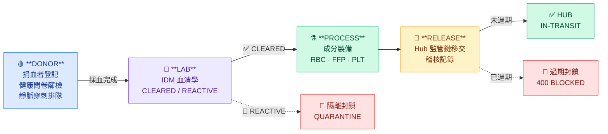
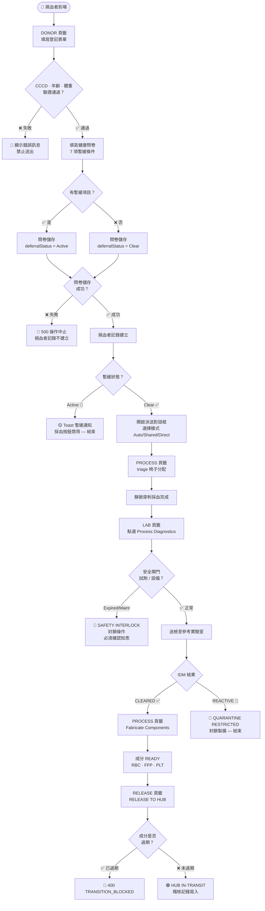
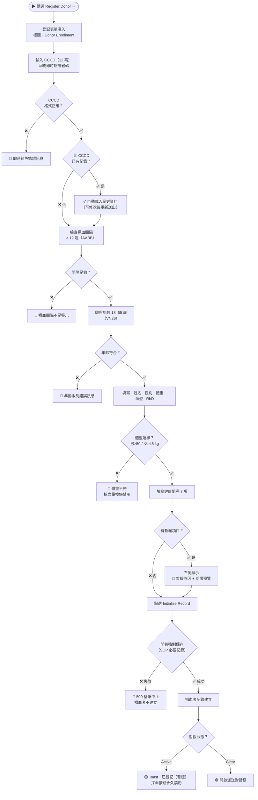
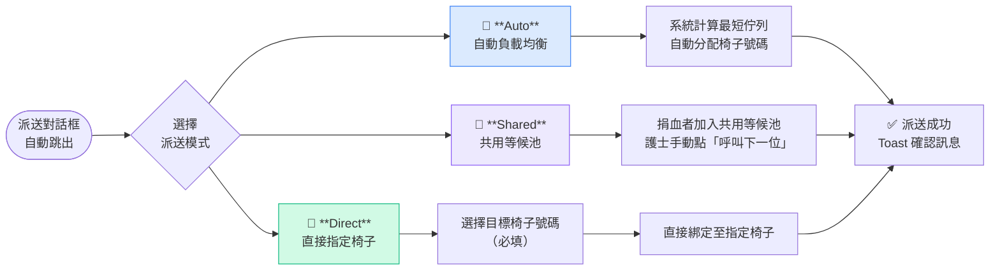
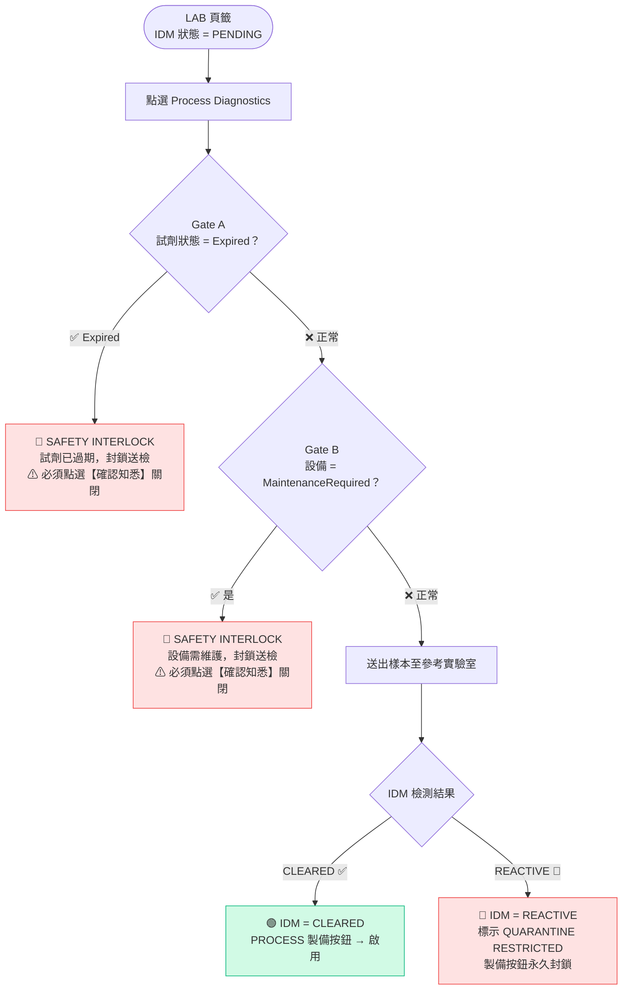
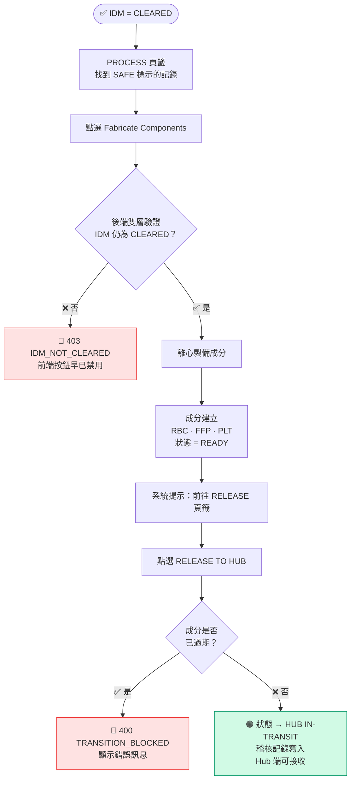
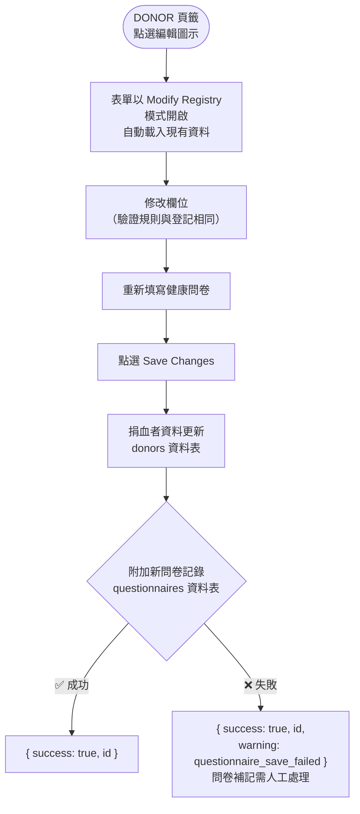

# 捐血中心 LIMS 使用手冊

**文件編號：** UM-LIMS-01 &nbsp;|&nbsp; **版本：** 1.1 &nbsp;|&nbsp; **更新日期：** 2026-05-30 &nbsp;|&nbsp; **系統版本：** VN-BECS V2

---

## 1. 子系統概述

捐血中心 LIMS（Laboratory Information Management System）模擬 eProgesa 平台，負責管理捐血者從報到到血液成分發送至 Hub 的完整臨床流程。

本系統遵循 **VN26**（越南衛生部血液安全規範）及 **AABB** 技術手冊（捐血間隔、採血量標準）。

### 四段式工作流程

| 段落 | 頁籤 | 主要功能 |
|------|------|---------|
| **DONOR** | 登記管理 | 捐血者登記、健康問卷篩檢、靜脈穿刺排隊派送 |
| **LAB** | 臨床診斷 | IDM 血清學檢測（CLEARED / REACTIVE / PENDING） |
| **PROCESS** | 成分製備 | 離心製備 RBC / FFP / PLT，triage 座椅管理 |
| **RELEASE** | 監管鏈 | 血液成分發送至 Hub，監管鏈交接驗證 |

---

## 2. 功能清單

| 功能 | 狀態 | API 端點 |
|------|------|---------|
| 捐血者登記（新增） | ✅ | POST `/api/v1/lims/donors` |
| 捐血者資料編輯 | ✅ | PUT `/api/v1/lims/donors/[id]` |
| 捐血者列表查詢 | ✅ | GET `/api/v1/lims/donors` |
| 健康問卷篩檢 | ✅ | 隨登記表單送出，儲存至 questionnaires 資料表 |
| 派送至靜脈穿刺椅 | ✅ | Auto / Shared / Direct 三種模式 |
| 排隊管理（等候池） | ✅ | PUT/DELETE `/api/v1/lims/queues/[id]` |
| IDM 血清學送檢 | ✅ | POST `/api/v1/lims/lab-tests/[id]/run` |
| 成分製備（離心） | ✅ | POST `/api/v1/lims/process-component/[id]` |
| Hub 成分發血 | ✅ | POST `/api/v1/lims/components/[id]/release` |
| 吞吐量就緒指標 | ✅ | 即時 KPI 儀表板（右上角百分比） |

---

## 3. 操作流程

### 3.0 整體流程總覽

---

### 流程 1：捐血者登記（DONOR 頁籤）

#### 步驟與驗證

#### 欄位快查

| 欄位 | 必填 | 驗證規則 |
|------|------|---------|
| CCCD 身分證號 | ✅ | 12 碼，越南省碼有效 |
| 姓名 | ✅ | 越南姓名格式，不得含數字或特殊符號 |
| 出生日期 | ✅ | YYYY/MM/DD，年齡 18–65 歲 |
| 性別 | ✅ | Male / Female（影響懷孕問卷顯示） |
| 體重（KG） | ✅ | 男≥50 / 女≥45 kg |
| 血型 / RhD | ✅ | 下拉選單 |

---

### 流程 2：派送至靜脈穿刺椅

| 模式 | 何時使用 | 系統行為 |
|------|---------|---------|
| **Auto** | 尖峰時段，平均分流 | 計算所有椅子佇列長度，選最短 |
| **Shared** | 椅子尚未確定 | 捐血者加入共用等候池，護士呼叫 |
| **Direct** | 特殊需求（殘障/VIP） | 強制綁定指定椅子 |

---

### 流程 3：IDM 血清學檢測（LAB 頁籤）

> **安全閘門說明：** 觸發時整個操作面板封鎖，顯示全幅紅色警示。操作人員 **必須** 手動點選【確認知悉】才能關閉，系統不會自動解除。

---

### 流程 4：成分製備與 Hub 發血

#### 成分製備規則

| IDM 狀態 | PROCESS 頁籤標示 | 製備按鈕 |
|----------|----------------|---------|
| CLEARED | 🟢 SAFE | ✅ 啟用 |
| REACTIVE | 🔴 QUARANTINE RESTRICTED | 🚫 永久禁用 |
| PENDING | 🟡 BIO-RISK | 🚫 禁用 |

---

### 流程 5：捐血者資料編輯

> **稽核設計：** 問卷採「附加」策略，每次編輯產生新記錄，保留完整決策歷史。符合 AABB 和 VN26 稽核要求。

---

## 4. 介面欄位規格

### 4.1 捐血者登記表單

| 欄位 | 型態 | 必填 | 驗證規則 | 備註 |
|------|------|------|---------|------|
| CCCD 身分證號 | 數字（12碼） | ✅ | 越南省碼驗證 | 可掃描晶片卡 |
| 姓名 | 文字 | ✅ | 越南姓名格式；禁止數字/特殊符號 | 自動轉大寫 |
| 出生日期 | YYYY/MM/DD | ✅ | 年齡 18–65 歲（VN26） | 自動格式化 |
| 性別 | 下拉選單 | ✅ | Male / Female | 影響懷孕問卷 |
| 體重（KG） | 數字 | ✅ | 男≥50 / 女≥45 kg | 影響採血量上限 |
| 血型 | 下拉選單 | ✅ | O / A / B / AB | — |
| RhD | 下拉選單 | ✅ | Positive / Negative | — |

### 4.2 健康問卷（7 項暫緩條件）

| 問卷項目 | 暫緩期限 |
|---------|---------|
| 近期刺青 | 12 週 |
| 前往瘧疾區域 | 12 週 |
| 身體不適 | 臨時（恢復後解除） |
| 高風險行為 | 永久 |
| 近期疫苗 | 4 週 |
| 近期牙科手術 | 1 週 |
| 懷孕或哺乳 | 永久（僅女性顯示） |

### 4.3 採血表單

| 欄位 | 型態 | 驗證規則 |
|------|------|---------|
| 捐血袋編號（DIN） | 文字 | ISBT-128 格式；可隨機產生 |
| 採血量（mL） | 數字 | 45–50 kg→250 mL；50–65 kg→350 mL；≥65 kg→450 mL（VN26） |
| 採血方式 | 下拉選單 | WholeBlood / Apheresis |

### 4.4 派送對話框

| 欄位 | 必填 | 說明 |
|------|------|------|
| 派送模式 | ✅ | Auto / Shared / Direct（預設 Shared） |
| 目標椅子 | 僅 Direct | 依機構椅子數量動態產生 |

---

## 5. 臨床驗證規則

| 規則 | 標準 | 系統行為 |
|------|------|---------|
| CCCD 格式 | 12 碼，省碼有效 | 即時錯誤，禁止送出 |
| 捐血者年齡 | 18–65 歲（VN26） | 即時錯誤，禁止送出 |
| 捐血間隔 | ≥ 12 週（AABB） | CCCD 輸入時即時檢查；送出時再次確認 |
| 採血量（WholeBlood） | 依體重分級（VN26） | 即時錯誤，採血按鈕禁用 |
| IDM 封鎖 | 成分製備前 IDM 須 = CLEARED | 前端禁用按鈕；後端 403 IDM_NOT_CLEARED |
| 過期封鎖 | 已過期成分不得發血 | 後端 400 TRANSITION_BLOCKED |
| 試劑過期閘門 | 試劑 = Expired → 封鎖送檢 | 紅色安全閘門警示 |
| 設備維護閘門 | 設備 = MaintenanceRequired → 封鎖 | 紅色安全閘門警示 |

---

## 6. 系統訊息與錯誤處理

| 情境 | 訊息類型 | 處理方式 |
|------|---------|---------|
| 捐血者登記成功（未暫緩） | 自動開啟派送對話框 | — |
| 捐血者登記成功（暫緩） | 🟡 Toast 警示 | 採血按鈕禁用 |
| 問卷儲存失敗（POST 登記） | 🔴 500 LIMS_DONOR_CREATE_FAILED | 整筆中止，捐血者不建立 |
| 問卷儲存失敗（PUT 編輯） | 200 + warning 欄位 | 捐血者已更新；問卷補記需人工 |
| CCCD / 年齡 / 間隔錯誤 | 表單內紅色錯誤訊息 | 禁止送出 |
| 安全閘門觸發 | 🔴 全幅警示框 | 必須手動確認知悉 |
| Hub 發血成功 | 🟢 Toast | 狀態 → HUB IN-TRANSIT |
| API 網路錯誤 | 🔴 錯誤框 | 顯示 "Network error" |

---

## 7. 權限與角色（RBAC）

| 角色 | LIMS 讀取 | 捐血者登記/編輯 | IDM 送檢 | 成分製備 | Hub 發血 |
|------|-----------|---------------|---------|---------|---------|
| Admin | ✅ | ✅ | ✅ | ✅ | ✅ |
| LIMS_Simulator | ✅ | ✅ | ✅ | ✅ | ✅ |
| DonorScreener | ✅ | ✅ | — | — | — |
| Manager | ✅ | — | — | — | — |
| QA_Officer | ✅ | — | — | — | — |

> 測試帳號：`admin` / `123`（開發環境）

---

## 8. i18n 語系覆蓋狀態（2026-05-30 v1.1）

| 鍵前綴 | EN | zh-TW | vi | 說明 |
|--------|----|----|----|----|
| `lims_err_*` | ✅ | ✅ | ✅ | 驗證錯誤訊息 |
| `lims_form_*` | ✅ | ✅ | ✅ | 表單標籤 |
| `lims_btn_*` | ✅ | ✅ | ✅ | 按鈕文字 |
| `lims_toast_*` | ✅ | ✅ | ✅ | 通知訊息 |
| `lims_gate_*` | ✅ | ✅ | ✅ | 安全閘門警示 |
| `lims_triage_*` | ✅ | ✅ | ✅ | 靜脈穿刺 triage |
| `lims_mission_*` | ✅ | ✅ | ✅ | 任務橫幅（v1.1 補齊） |
| `lims_status_*` | ✅ | ✅ | ✅ | 狀態標籤 |
| `qst_*` | ✅ | ✅ | ✅ | 健康問卷 |

殘留硬編碼：`"Abo/Rh"`（國際通用臨床術語，刻意保留英文）。

---

## 9. 已修正問題（v1.0 → v1.1）

| # | 問題 | 嚴重性 | 修正 |
|---|------|--------|------|
| 1 | `PUT /api/v1/lims/donors/[id]` 路由缺漏 | 🔴 高 | 新增完整 PUT 路由 |
| 2 | POST 問卷儲存靜默失敗 | 🔴 高 | 移除 `.catch()`，fail-fast |
| 3 | PUT 問卷失敗無回饋 | 🟡 中 | 改為 try/catch + warning 欄位 |
| 4 | 任務橫幅硬編碼英文 | 🟡 中 | `t('lims_mission_site_a')` |
| 5 | 5 處硬編碼 UI 字串 | 🟡 中 | 共補 11 個 i18n 鍵（三語） |

---

## 10. 尚待確認事項

| # | 事項 | 說明 |
|---|------|------|
| 1 | Apheresis 採血量上限規則 | VN26 Apheresis 條款待查 |
| 2 | COLD-01 冷鏈 E2E 測試 | 需實機環境驗證 |

---

## 附錄：API 端點一覽

| 方法 | 路徑 | 說明 |
|------|------|------|
| GET | `/api/v1/lims/donors` | 捐血者列表 |
| POST | `/api/v1/lims/donors` | 新增捐血者 |
| GET | `/api/v1/lims/donors/[id]` | 查詢單一捐血者 |
| PUT | `/api/v1/lims/donors/[id]` | 編輯捐血者資料 |
| POST | `/api/v1/lims/collect` | 記錄採血 |
| GET | `/api/v1/lims/donations` | 捐血記錄列表 |
| GET | `/api/v1/lims/components` | 血液成分列表 |
| POST | `/api/v1/lims/process-component/[id]` | 成分製備 |
| POST | `/api/v1/lims/components/[id]/release` | Hub 發血移交 |
| POST | `/api/v1/lims/lab-tests/[id]/run` | IDM 送檢 |
| GET/POST/PUT/DELETE | `/api/v1/lims/queues/[id]` | 等候佇列管理 |
| GET | `/api/v1/lims/questionnaires` | 問卷列表 |
